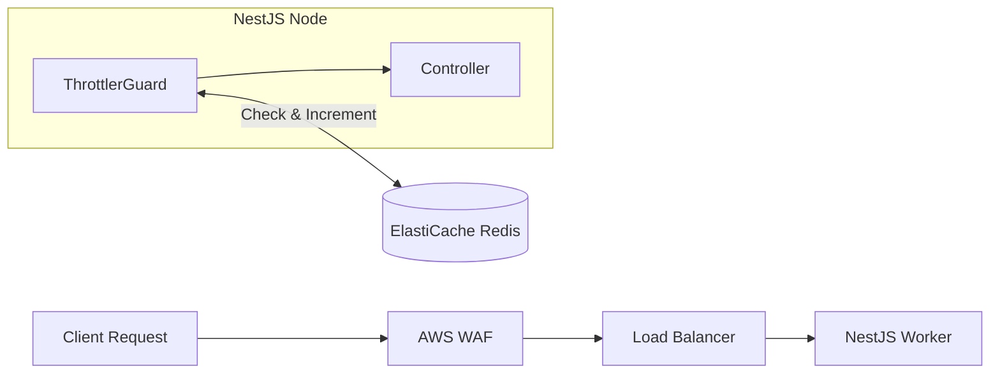

# API Rate Limiting Strategy

To prevent API abuse, accidental DDOS, and backend resource exhaustion, the NestJS `@nestjs/throttler` module must be finely tuned. Currently, the global rate limit is broadly set. Moving to 1M users requires route-specific rate limiting backed by an ElastiCache Redis cluster.

## Architecture

## Recommended Throttler Limits

Limits are defined as `Limit / TTL (Time to Live)`. These limits are evaluated per Client IP (via `trust proxy`) and per Authenticated User ID (if JWT is present).

### 1. Authentication APIs
Authentication is CPU intensive (bcrypt/hashing) and highly targeted by credential stuffing.
- **Login / OAuth Callback:** `5 requests / 1 minute`
- **Registration / OTP Generation:** `3 requests / 5 minutes`
- **Action on breach:** Immediate 429 Too Many Requests, IP flagged in WAF after 3 breaches.

### 2. Voting APIs
Voting writes to the database, requires row locks, and is heavily targeted during elections.
- **Vote Casting (`/votes/cast`):** `2 requests / 1 minute` (Burst limit of 2 to allow for accidental double-clicks, business logic rejects the second anyway).
- **Vote Verification:** `10 requests / 1 minute`

### 3. Chat & Forum APIs (WebSockets / HTTP)
- **Send Message:** `30 requests / 1 minute`
- **Typing / Presence Updates:** `120 requests / 1 minute` (Should ideally be handled by WebSockets directly to bypass HTTP overhead).
- **Action on breach:** Disconnect socket briefly or drop messages silently.

### 4. Public & Discovery APIs
Heavily cached routes but still require protection from scrapers.
- **Aspirant Search/Pagination:** `100 requests / 1 minute`
- **Ward Browsing:** `200 requests / 1 minute`

### 5. Admin APIs
- **Dashboard / User Management:** `60 requests / 1 minute`

## Implementation Recommendations

1. **Redis-Backed Throttler:** Continue using `@nest-lab/throttler-storage-redis`. Ensure Redis is deployed in a Multi-AZ cluster mode. A single Redis node cannot handle 15k RPS (30k+ commands/sec) without noticeable latency.
2. **WAF Interaction:** The NestJS throttler protects the database and CPU. However, volumetric DDoS attacks will still overwhelm the EC2 network layer. **AWS WAF** must be configured to drop requests *before* they hit the ALB if an IP exceeds 2,000 requests per 5 minutes.
3. **User-Based Throttling:** Override the `ThrottlerGuard.generateKey` method to use the user's JWT ID (`req.user.id`) instead of just IP. This prevents NAT/Carrier-Grade NAT (CGNAT) users on mobile networks from inadvertently blocking each other.
