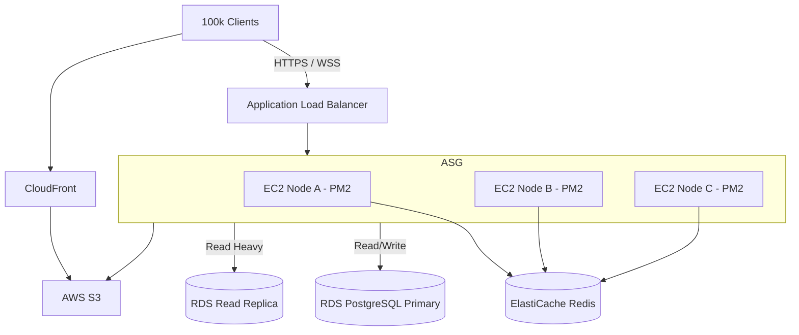
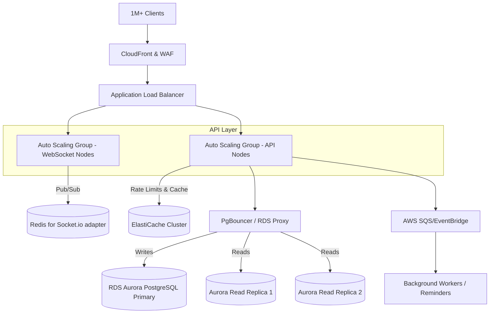

# Architecture Assessment

## Overview
The Prajaakeeya backend is a modular monolithic REST API built using **NestJS 10** and **TypeScript**, backed by **PostgreSQL** (via TypeORM) and **Redis** (via ElastiCache). It serves a Vite PWA frontend and mobile clients. 

Media uploads are directly stored in **Amazon S3** and distributed globally via **CloudFront**.

The API endpoints are served using a **PM2 cluster**, taking advantage of multiple cores per EC2 instance. The application is highly decoupled into feature modules (e.g., Auth, Aspirants, Wards, Votes, Forum, Reminders) which communicate through shared common modules.

## Architecture Diagrams

### 1. Current Architecture (Single Instance / Low Traffic)
```mermaid
graph TD
    Client[Client Devices (PWA/Mobile)] -->|HTTPS| ALB[Application Load Balancer]
    ALB --> EC2[EC2 Instance]
    
    subgraph EC2[EC2 Instance - PM2 Cluster]
        Node0[NestJS Worker 0]
        Node1[NestJS Worker 1]
    end
    
    Node0 -.->|Read/Write| DB[(RDS PostgreSQL Primary)]
    Node1 -.->|Read/Write| DB
    
    Node0 -.->|Rate Limiting / Cache| Redis[(ElastiCache Redis)]
    Node1 -.->|Rate Limiting / Cache| Redis
    
    Node0 -.->|Presigned URLs| S3[AWS S3]
    Client -->|Direct Upload| S3
    S3 --> CF[CloudFront CDN]
    CF --> Client
```

### 2. 100k User Architecture (Moderate Scale)


### 3. 1M User Architecture (High Scale)


## Component Analysis

### 1. Compute Layer (NestJS on PM2)
- **Current State**: Requests hit an API load balancer and are forwarded to PM2 managed instances.
- **Scalability**: High. NestJS is stateless, meaning instances can scale horizontally indefinitely as long as state (sessions, cache, rate limits) remains in Redis.
- **Risk**: WebSocket connections (`AspirantChatModule`, `ForumModule`) are stateful. Sticky sessions and a Redis adapter must be implemented when scaling past a single node.

### 2. Data Layer (PostgreSQL)
- **Current State**: Single RDS PostgreSQL instance accessed via TypeORM. Uses local connection pooling (`DB_POOL_MAX` = 10 per worker).
- **Scalability**: Medium. A single writer is fine up to ~5-10k TPS depending on instance size, but connection limits will quickly be exhausted as horizontal PM2 nodes increase.
- **Risk**: At 100 EC2 instances running 4 PM2 workers each (400 workers), the database will face 4,000 idle connections, causing severe memory overhead and CPU context switching on Postgres. **RDS Proxy or PgBouncer is strictly required for >100k DAU.**

### 3. Caching and Throttling Layer (Redis)
- **Current State**: Used by `@nestjs/throttler` and `@nestjs/cache-manager`. Throttler is currently set to 200 req/min/IP.
- **Scalability**: Very High. AWS ElastiCache handles high throughput efficiently.
- **Risk**: Every request hits Redis for rate-limiting. As RPS approaches 15k, a single Redis node might approach limits. A Multi-AZ Redis cluster with replication is recommended.

### 4. Media Layer (S3 + CloudFront)
- **Current State**: Direct upload to S3 via presigned URLs and retrieval via CloudFront.
- **Scalability**: Excellent. This entirely offloads heavy I/O tasks from the Node.js event loop.
- **Risk**: Ensure CloudFront cache policies are aggressive for public media, reducing S3 GET costs.

### 5. Background Jobs (Cron Reminders)
- **Current State**: Running via `@nestjs/schedule` restricted to `NODE_APP_INSTANCE === "0"`.
- **Scalability**: Low. This single point of failure and bottleneck means reminders for 1M users must be processed sequentially by one PM2 worker.
- **Risk**: Processing a table of 1M users to check for reminders every minute will cause long event-loop blockages. **Must transition to SQS / BullMQ.**
